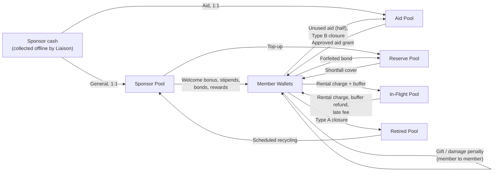

# Mithra

**A community-driven lending, sharing and caring platform**

**Lend. Share. Care.**

| Project Proposal (Revised) | |
| :--- | :--- |
| **Project** | Second Year Group Project — Group CS52 |
| **Duration** | 12 months |
| **Team size** | 4 members |
| **CRUD modules** | 23 planned (minimum required: 16) |
| **Revision** | Incorporates all panel comments addressed in the Action Plan (Issues 01–06). See Appendix B. |

| Technology Constraints |
| :--- |
| **Frontend:** Vanilla HTML, CSS, JavaScript only — no frameworks, no libraries |
| **Backend:** PHP (pure PHP only — no frameworks) |
| **Database:** MySQL |
| **Interface language:** English only |

---

## Contents

1. Executive Summary
2. The Story Behind Mithra
3. Problem Statement and Motivation
4. Project Scope and Operational Boundaries
5. The Five Actors
6. Member Capabilities, Trust Score and New Members
7. The Point System
8. Rental Pricing
9. Item Listing and Declared-Value Validation
10. Condition Photos and Damage Handling
11. Peer Gifting
12. Aid Grants
13. Donations
14. Disaster Mode
15. Sponsor Contributions and Fund Management
16. Moderators — Selection, Role, Authority and Limitations
17. Account Lifecycle — Closure Types
18. Core Workflows (End-to-End)
19. Edge Cases
20. CRUD Module Distribution
21. System Architecture Overview
22. Database Design (High-Level)
23. Technology Stack
24. 12-Month Timeline
25. Feasibility Study (including Legal Considerations)
26. Risk Register
27. Success Metrics
28. Open Questions for the Team
29. Appendix A — Glossary
30. Appendix B — Action Plan Traceability

---

## 1. Executive Summary

Mithra — the name means *friend* — is a web-based community platform that helps neighbours in the same Grama Niladhari (GN) division lend, share and give to each other. Members earn points by lending out items they already own, and spend those points when they need to borrow something themselves. Mithra is intentionally hyper-local: one GN division per deployment, a single trusted Moderator per division, and a closed-loop points economy funded entirely by sponsors.

Members never spend cash on the platform — by design. Sponsor companies contribute cash offline to the Sponsor Liaison under a written agreement. Every rupee contributed is converted into exactly one point, with no deductions, so 100% of every contribution reaches the community through the points economy. Each contribution is recorded as either **General** (welcome bonuses, moderator stipends and other approved community rewards) or **Aid** (reserved exclusively for approved aid grants). All points are held in six dedicated pools, every movement is written to an append-only ledger, a nightly automated check proves that no points have been lost or created without authorisation, and a transparency dashboard lets members and sponsors see the result.

Three principles shape every feature of Mithra:

- **Lend** — points-based borrowing of everyday items between verified neighbours.
- **Share** — peer gifting and a transparent trust score that lets neighbours decide who to lend to and borrow from.
- **Care** — permanent donations, aid grants, and a Disaster Mode that connects sponsors with the community during emergencies.

Mithra operates as a non-profit, social-impact initiative. No cash is ever transferred to members, points cannot be converted to cash, and all funding is reinvested into the platform's community mission, with periodic independent external financial audits.

The platform is built as a server-rendered PHP application with a MySQL database and a vanilla HTML/CSS/JavaScript front-end — no frameworks, no libraries. The interface is English only. This deliberate simplicity keeps the codebase accessible to a four-person team, keeps hosting requirements minimal (any standard LAMP environment), and keeps the focus on the community logic rather than on tooling.

---

## 2. The Story Behind Mithra

Pradeep lives in a Nugegoda apartment. Last year he bought a power drill for Rs. 8,500 to hang three picture frames. It has lived in his cupboard ever since. Two floors below, Nimali is putting up curtain rails this weekend and is about to spend another Rs. 8,500 on the same drill.

They live in the same building. They have nodded at each other in the lift. Neither of them knows the other has, or needs, that drill.

This story repeats itself across every neighbourhood in Sri Lanka, every day. Suitcases, projectors, sewing machines, baby cots, camping tents, large cooking pots, pressure washers, board games and ladders — bought once, used twice, and stored forever, while neighbours quietly buy the same items or simply go without.

> **The items already exist. The need already exists. What's missing is a way to connect them.**

On Mithra, Pradeep lists his drill. Nimali, verified as a member of the same GN division, sees it and borrows it for the weekend. Pradeep earns 170 points he can later use to borrow her sewing machine. The drill comes back on Sunday. Both rate each other in the app. Nothing dramatic happens. They smile in the lift on Monday.

Multiply that across a building, a lane and a division, and the cupboards of an entire neighbourhood become a shared library of things.

### 2.1 Three modes, one platform

**Lend.** Everyday items, point-based, between verified neighbours. Pradeep, Nimali and the drill — the platform's everyday case.

**Share.** Sometimes a borrower doesn't have items to lend yet, or a lender wants to send a neighbour a small thank-you. Peer gifting lets members send small point gifts — birthdays, splitting a rental, helping a new member get started.

**Care.** A young family who has just moved in needs to borrow a fan but has nothing yet to lend. Their Moderator vouches, the Sponsor Liaison approves, and an aid grant covers their borrowing — quietly, without anyone in the lane knowing it was a grant. When heavy rains flood half the lane, Disaster Mode alerts sponsors to the emergency and connects them directly with the Moderator, who arranges relief on the ground.

---

## 3. Problem Statement and Motivation

### 3.1 What we are solving

- Households accumulate items that sit idle for most of their lifespan.
- Borrowing from neighbours informally is socially awkward and rarely extends beyond the closest two or three households.
- There is no fair, traceable way to record who borrowed what, the agreed price, and the return condition.
- Cash-based rental platforms feel transactional, exclude lower-income participants, and discourage neighbourly help.
- Families in genuine need have nowhere to turn for one-off borrowing — charities focus on permanent aid, neighbours feel awkward, and formal rental excludes them by cost.
- During disasters, help is coordinated on messaging groups — fast but chaotic, with no record of who needs what or who has helped.

### 3.2 Why this fits as a one-year project

- Clear, bounded scope — one GN division per deployment.
- Substantial domain logic — point system, trust score, condition photos, value validation, gifting, aid and disaster handling — well beyond standard CRUD work.
- Five distinct actors with genuinely different permission sets.
- Real-world testability — a pilot in one GN division is feasible.
- Strong social-impact angle for evaluation.

---

## 4. Project Scope and Operational Boundaries

### 4.1 In scope

- Web-based, responsive platform (works on mobile browsers).
- Five actors: Member, Moderator, Sponsor Liaison, Admin, Sponsor.
- No cash from members.
- Closed-loop points economy funded entirely by sponsors.
- Item lending between verified members of the same GN division.
- Condition photos at handover and return, with both-party acceptance.
- Two-track damage handling: simple agreed cases handled automatically; contested cases handled by the Moderator with three-party signoff.
- Permanent donations.
- Aid grants.
- Peer gifting.
- Disaster Mode.
- Trust score visible on every listing and lending screen.
- Dual-community membership for temporary residents (one home community, one temporary community).
- Transparency dashboard showing pool balances, contributions, allocations, aid distributions and the latest verification result.

### 4.2 Out of scope (deliberately)

- Native mobile apps (responsive web only).
- Cash from members in any form — no top-ups, subscriptions or collateral.
- Conversion of points to cash under any circumstance.
- In-app payment gateway — sponsor cash is collected offline and only recorded by the Sponsor Liaison.
- Multi-division federation (future feature).
- Item delivery logistics.
- Insurance integration.
- Automatic disaster detection — the Admin toggles Disaster Mode.
- Financial audit management — independent external audits are carried out outside the system; the platform only supplies the ledger records and reports auditors need.
- Multi-language localisation — the interface is English only.
- Second-hand sales — items a member no longer wants are donated, not sold.

### 4.3 Operational limits

| Limit | Value |
| :--- | :--- |
| Deployment scope | One GN division per deployment. |
| Communities per member | Maximum two (one home, one temporary). |
| Aid grant cap | 500 points per member per year. |
| Peer gifting — daily | 200 points per day per sender. |
| Peer gifting — annual | 2,000 points per year per sender. |
| Welcome bonus | 200 points, once, after moderator verification. |
| Moderator stipend | 100 points per month per active moderator. |
| Moderator conduct bond | 500 points. |

### 4.4 How Mithra thinks about points

Sponsor cash creates points at a 1:1 rate so that pricing decisions can be grounded in real item values. This backing is visible only to the Admin and Sponsor Liaison in their accounting views and, in aggregate, on the transparency dashboard.

Members see only points throughout the UI. A drill's declared value, the rental rate and any damage penalty are all expressed in points. Points are presented and treated as platform credit earned by participating in the community — not as a currency.

Because members never put cash into the platform and never withdraw points as cash, the platform handles no member money. Cash flows in only from sponsors, is never paid out to members, and the points it creates never leave the platform.

---

## 5. The Five Actors

Borrower, Lender, Donor and Recipient are all the same Member role — every member can play any of these depending on the situation. Four further actors support and govern the platform.

| Actor | Who they are | What they do |
| :--- | :--- | :--- |
| **Member** | A verified resident of one GN division (home community), optionally also holding one temporary community. | List items, browse, request, confirm handover and return, donate, gift, request aid, rate. |
| **Moderator** | One trusted resident per GN division, selected through the process in Section 16. Holds a 500-point conduct bond. | Verify new members, approve listings and validate declared values, vouch for aid requests, resolve contested damage cases in person, report disasters. |
| **Sponsor Liaison** | Platform-wide role linking sponsor companies and the platform. | Onboard sponsors, record contributions (General / Aid), approve aid grants, top up the Reserve Pool, verify and record Disaster Mode contributions, generate CSR reports, receive monthly moderator-activity summaries. |
| **Admin** | The platform operator (project team in production; lecturer/panel during evaluation). | Manage divisions and categories, run moderator selection and appointment, view global analytics, handle escalated disputes, toggle Disaster Mode, act as interim moderator before the first appointment. |
| **Sponsor** | A company funding the points economy for CSR visibility. | Make contributions and choose their type (General / Aid), view the CSR impact dashboard and reports, upload branding, respond to Disaster Mode alerts. |

---

## 6. Member Capabilities, Trust Score and New Members

Mithra has a single member tier. Every verified member has the same capabilities and rights. There are no subscriptions, fees, collateral deposits or cash transactions with the platform.

### 6.1 What every member can do

- List items for lending, with declared-value proof (Section 9).
- Browse and request to borrow items listed in their division.
- Confirm handover and return of items, with photo records (Section 10).
- Donate items permanently to other members (Section 13).
- Send small point gifts to other members in the same division, subject to caps (Section 11).
- Request an aid grant when in genuine need (Section 12).
- Rate and review other members after every transaction.
- Close their account at any time (Section 17).
- Join a temporary community while keeping their home community active (Section 6.5).

### 6.2 What members cannot do

- Top up their wallet with cash.
- Pay a subscription, deposit collateral, or otherwise transact in real currency with the platform.
- Convert points back to cash.

If a member wants to borrow something but does not have enough points, the platform encourages them to list items they own — earning points through participation. Members in genuine hardship can request an aid grant.

### 6.3 Trust score — specification

Because there are no tier-based or value-based borrowing caps, members rely on each other's reputation to decide whether to lend. Every member has a single trust score from 0 to 100, shown on their profile and on every item listing and lending screen.

#### 6.3.1 The five weighted factors

Each factor is first normalised to a 0–100 scale.

| Factor | Symbol | Weight | How it is measured (normalised to 0–100) |
| :--- | :--- | :--- | :--- |
| Average rating | R | 40% | Average star rating from completed transactions: (average stars ÷ 5) × 100. |
| Completed transactions | V | 20% | Number of completed transactions, capped at 50: (min(n, 50) ÷ 50) × 100. |
| Return reliability | L | 20% | Percentage of rentals returned on time. Donations are excluded. |
| Member tenure | T | 10% | Months of verified membership, capped at 12: (min(months, 12) ÷ 12) × 100. |
| Community contribution | C | 10% | Contribution score based on donations made, capped at 100. |

> **Weighted score:** Computed = 0.40R + 0.20V + 0.20L + 0.10T + 0.10C

#### 6.3.2 Confidence blend (Bayesian shrinkage)

A member with a single five-star rating should not outrank a member with fifty consistently good transactions, and a new member should not start unfairly low. The computed score is therefore blended with a neutral prior of 50:

> **S = (K × 50 + n × Computed) ÷ (K + n)**, where K = 10 and n = number of completed transactions.

With n = 0, S = 50 exactly. As completed transactions accumulate, the displayed score converges on the member's actual computed score.

#### 6.3.3 Penalty deductions

Applied after the confidence blend:

| Event | Deduction |
| :--- | :--- |
| Each upheld damage claim | −5 |
| Each past account suspension | −10 |
| Each shortfall-covered incident (Reserve Pool covered the member, Section 7.8) in the previous 12 months | −5 |

The final score is clamped to 0–100 and rounded to the nearest whole number.

#### 6.3.4 Update triggers

| Trigger | What is recalculated |
| :--- | :--- |
| Completion of any transaction (rental, donation, damage resolution) | Full recalculation for both parties. |
| Nightly scheduled cron job | Full recalculation for all members (also refreshes tenure and the 12-month penalty window). |

#### 6.3.5 How the score is used

- Displayed on every member profile and item listing, with a division context line (e.g. *★ 78 overall · 12 completed in this division · 3 completed in temporary community*).
- Lenders evaluate borrower reliability before approving a request.
- Moderators reference it during dispute resolution and other trust-related decisions.
- It forms part of the moderator eligibility criteria (Section 16.2).
- A low score does not block participation — it is informational, and each lending decision stays with the member.

### 6.4 New members — initial points and initial trust score

| Item | Value | Rule | Rationale |
| :--- | :--- | :--- | :--- |
| **Welcome bonus** | 200 points | Credited from the Sponsor Pool **only after** the Moderator has verified the member's identity (NIC) and address. Credited once per verified person. | Enough for a first short borrowing of an everyday item so a new member can participate before they have lent anything. Kept small, and gated behind in-person-supported verification, so creating fake accounts gains very little. |
| **Initial trust score** | 50 | Not assigned by hand — it is the output of the confidence blend (Section 6.3.2) when n = 0. | A neutral starting point: neither trusted nor distrusted. Reputation is then earned through genuine transactions, ratings and behaviour. |

Unverified accounts cannot borrow, lend, gift or receive points.

### 6.5 Dual-community membership (temporary residents)

Students, workers on assignment and others living away from home for a period can belong to a second community.

- Every member has exactly one **home community** — verified once, never expires.
- A member may hold at most one active **temporary community** at a time (maximum two communities in total).
- Temporary membership requires proof of residence in the second division (for example a university enrolment letter, a signed lease or rental agreement, or an employer letter), verified by that division's Moderator.
- Temporary membership lasts 6 months and can be extended by submitting fresh proof.
- If temporary membership expires, the member's listings in that division are auto-paused. Active bookings run to completion; only new bookings are blocked. A 14-day grace window allows resubmission; after that the member must re-apply.
- A member may promote a temporary community to their home community; the old home can then be joined as a temporary community.
- Items are listed in exactly one division, and a borrower must be an active member of that division to borrow them.

---

## 7. The Point System

### 7.1 The base unit

One point is the indivisible base unit — there are no fractions. When a calculation produces a fraction, penalties are rounded in the lender's favour and refunds are rounded in the borrower's favour.

### 7.2 How points are created

Points are created in exactly one way: **sponsor contributions**. A sponsor pays cash offline to the Sponsor Liaison; the Liaison records the contribution, and points are created at **1 rupee = 1 point, with no deductions**. Each contribution is recorded as General (into the Sponsor Pool) or Aid (into the Aid Pool). Nothing else creates points.

Welcome bonuses, moderator stipends, conduct bonds and community rewards are not new points — they are movements out of the Sponsor Pool.

### 7.3 How points move within the system

| Movement | From | To | Trigger |
| :--- | :--- | :--- | :--- |
| Welcome bonus | Sponsor Pool | Member wallet | Moderator verifies a new member. |
| Moderator stipend | Sponsor Pool | Moderator wallet | Monthly cron, if the moderator was active. |
| Conduct bond | Sponsor Pool | Moderator wallet (locked) | Moderator appointment. |
| Community reward (e.g. festival drop) | Sponsor Pool | Member wallets | Admin/Liaison-approved reward. |
| Reserve top-up | Sponsor Pool | Reserve Pool | Liaison tops up a low Reserve. |
| Rental charge + late-fee buffer | Borrower wallet | In-Flight Pool | Lender accepts the booking request. |
| Rental charge release | In-Flight Pool | Lender wallet | Both parties accept the handover record. |
| Buffer refund | In-Flight Pool | Borrower wallet | On-time return with no damage claim. |
| Late fee | Borrower (buffer, then wallet) | Lender wallet | Late return (automatic). |
| Simple-path damage penalty | Borrower wallet | Lender wallet | Borrower accepts a minor claim (Section 10.4). |
| Moderator-path outcome | As decided | As decided | Three-party signoff (Section 10.5). |
| Shortfall cover | Reserve Pool | Lender wallet | Borrower cannot cover an agreed penalty or late fee. |
| Gift | Sender wallet | Recipient wallet | Peer gift (Section 11). |
| Aid grant | Aid Pool | Member wallet | Liaison approves a vouched request. |
| Unused aid return | Member wallet | Aid Pool | Half of unused grant after 30 days. |
| Bond forfeiture | Moderator bond | Reserve Pool | Removal for cause. |
| Account closure (Type A) | Member wallet | Retired Pool | Standard closure. |
| Account closure (Type B) | Member wallet | Aid Pool | Parting-gift closure. |
| Recycling | Retired Pool | Sponsor Pool | Scheduled cron. |
| Donation | — | — | Item ownership transfers; no points move. |

### 7.4 The six pools

Every point in the system lives in exactly one of six pools at every moment.

| Pool | Purpose | Funded by |
| :--- | :--- | :--- |
| **Sponsor Pool** | General-purpose community fund: welcome bonuses, stipends, conduct bonds, approved rewards, Reserve top-ups. | General contributions; recycled Retired points. |
| **Aid Pool** | Reserved exclusively for approved aid grants. | Aid contributions; Type B closures; unused aid returns. |
| **Reserve Pool** | Safety net that covers shortfalls so no balance goes negative. | Top-ups from the Sponsor Pool; forfeited conduct bonds. |
| **In-Flight Pool** | Holds rental charges and late-fee buffers during active bookings. | Borrower wallets. |
| **Member Wallets** | Points held by individual members (including locked moderator bonds). | All member-facing movements. |
| **Retired Pool** | Balances of closed (Type A) accounts, awaiting recycling. | Type A closures. |

> **The Nightly Invariant Check**
>
> Σ (Sponsor + Aid + Reserve + In-Flight + Wallets + Retired) = Σ points created from sponsor contributions
>
> Points are only ever created by recorded sponsor contributions and are never destroyed — they only move between pools. Every night, a PHP CLI script run by cron sums the six pools and checks that the total equals the total points ever created. It also checks that each pool's balance equals the sum of its ledger entries. Any drift triggers a critical alert to the Admin, and the result of every run is shown on the transparency dashboard.

### 7.5 Points Flow Diagram

### 7.6 Late fees (automatic)

- Every rental holds a late-fee buffer of one daily rate in In-Flight.
- 1–24 hours late: buffer forfeited to the lender.
- 25–72 hours late: buffer plus one daily rate per additional 24-hour block, deducted from the borrower's balance.
- More than 72 hours late: item flagged as unreturned and the Moderator alerted. After 7 days it is treated as a total loss and handled on the moderator path (Section 10.5).

### 7.7 No negative balances — Reserve Pool guarantee

**A member's point balance can never go negative.**

If a late fee, damage penalty or other agreed deduction exceeds a member's available balance, the member pays what they have and the Reserve Pool covers the remainder so the lender still receives the full amount. The member carries no debt.

- Each cover is logged in the ledger as a Reserve shortfall cover — permanent and traceable.
- It counts as a shortfall-covered incident in the member's trust score for 12 months (Section 6.3.3).
- If the Reserve runs low, the Admin notifies the Sponsor Liaison, who tops it up from the Sponsor Pool.

Why this rule exists: it prevents members from being trapped working off points they owe, lets moderators decide what is fair without calculating ability to pay, and makes the cost of the community safety net visible to sponsors.

### 7.8 Worked example

Pradeep's drill has a validated declared value of 8,500 points. Pradeep sets his rate at 85 points per day.

1. Nimali (balance 500) requests the drill for 2 days. When Pradeep accepts, 170 + 85 = 255 points move from her wallet to In-Flight (rental charge plus one-day late-fee buffer).
2. At pickup, both upload condition photos and accept the handover record. 170 points move to Pradeep's wallet; the 85-point buffer stays in In-Flight.
3. On-time return, both confirm the condition matches the baseline: the 85-point buffer returns to Nimali. Pradeep finishes with +170 points.
4. **Minor scratch, agreed:** Pradeep raises a Minor claim proposing 1,000 points (within the 20% guideline). Nimali accepts in the app within 48 hours, and 1,000 points move automatically from her wallet to Pradeep's (simple path). If her balance were short, the claim would move to the moderator path instead.
5. **Badly chipped casing, contested:** Nimali disagrees. The claim goes to the moderator path — all three meet in person, the Moderator decides, and all three sign off in the app before any points move.

---

## 8. Rental Pricing

Mithra does not impose fixed rental rates. Lenders set their own daily and/or monthly rates. This respects each lender's judgement and avoids a centrally maintained rate schedule.

### 8.1 How a lender sets a rate

- The lender enters a daily rate and/or a monthly rate in points.
- The item's validated declared value is shown for context.
- Lenders can offer daily only, monthly only, or both. If both are offered, borrowers see whichever is cheaper for their requested duration.
- Rates can be changed at any time; changes do not affect active bookings.

### 8.2 Pricing guidance (non-binding)

> **Pricing tip:** Community lending typically works well at 1–2% of declared value per day. For a 5,000-point item, that's 50–100 points per day. You're free to set any rate — this is just a starting point.

There is no rate cap, no minimum and no moderator approval of pricing. Neighbours deciding whether a rate feels fair are the regulator.

### 8.3 Categories

Items are assigned to a category (Tools & Hardware, Household Appliances, Electronics, Books & Media, etc.) for browsing and search. Categories do not determine pricing.

### 8.4 What the borrower sees

- The daily rate, the monthly rate (if offered) and the declared value.
- For a requested duration, which option is cheaper.
- Requests longer than 27 days are nudged toward the monthly rate if offered.
- The lender's trust score and rating history.

---

## 9. Item Listing and Declared-Value Validation

The declared value anchors pricing guidance and damage penalties, so it must be realistic. Every listing's declared value is validated by the Moderator before the item goes live.

### 9.1 Proof requirements

| Declared value | Proof required |
| :--- | :--- |
| Up to 2,000 points | Item photos and a short description. |
| 2,001 – 10,000 points | Item photos plus one of: purchase receipt, warranty card, or a current retail price reference. |
| Above 10,000 points | Purchase receipt or warranty card, **or** an in-person inspection by the Moderator. |

*(Thresholds are proposed values to be confirmed by the team — see Section 28.)*

### 9.2 Moderator decision

The Moderator can **approve** the listing, **adjust** the declared value (with a reason shown to the lender), or **reject** it with a reason. All decisions are recorded in the listing's audit trail. A Moderator cannot validate their own listings; those go to the Admin (Section 16.5).

---

## 10. Condition Photos and Damage Handling

Mithra protects both lenders and borrowers through (1) handover and return condition photos, which create an immutable record of the item's state before and after the rental, and (2) a two-track damage process: simple agreed cases are settled automatically, and contested or serious cases are resolved in person by the Moderator.

### 10.1 At handover

When lender and borrower meet at the agreed pickup time:

- Each party uploads 1–5 photos. The platform stamps each photo with the timestamp and uploader's user ID using PHP's GD library.
- Each party can add a note describing pre-existing scratches, dents, missing accessories or other condition details.
- The combined record is shown to both. Each party clicks **Accept** or **Cancel**.

| Decision | What happens |
| :--- | :--- |
| Both accept | Handover record locked as the baseline. Rental charge moves from In-Flight to the lender. Rental is in progress. |
| Either party cancels | Booking cancels with no penalty. All In-Flight points return to the borrower. Both can rate the cancellation. |
| No decision within 48 hours | Booking auto-cancels. Points return to the borrower. Both notified. |

### 10.2 At return

The same photo-and-notes process repeats, and the platform shows the handover baseline beside the return record.

| Situation | What happens |
| :--- | :--- |
| Both accept — condition matches baseline | No claim. Buffer returns to borrower (if on time). Booking closes. Both rate. |
| Lender raises a Minor claim within the guideline | Simple path (Section 10.4). |
| Lender raises a Moderate, Major or Total-loss claim | Moderator path (Section 10.5). |
| Borrower contests any claim, or does not respond within 48 hours | Moderator path (Section 10.5). |
| No return record by the due time | Item flagged as not returned; late fees apply (Section 7.6). |

### 10.3 Choosing the track

| Condition | Track |
| :--- | :--- |
| Severity is Minor **and** proposed penalty ≤ 20% of declared value **and** borrower accepts within 48 hours **and** borrower's balance covers the penalty | **Simple path** — automatic |
| Any other case | **Moderator path** — in person, three-party signoff |

### 10.4 Simple path (agreed minor cases)

1. The lender raises a claim, selects Minor, and proposes a penalty up to 20% of the declared value, with supporting photos.
2. The borrower sees the claim beside the baseline photos and clicks **Accept** or **Contest** within 48 hours.
3. On acceptance, the penalty moves automatically from the borrower's wallet to the lender's, the buffer is settled, and the booking closes.
4. Acceptance is final, but the borrower may raise a separate dispute with the Admin within 7 days.

### 10.5 Moderator path (contested and serious cases)

1. The booking enters *pending moderator*. No points move automatically.
2. Lender, borrower and Moderator meet in person within 7 days.
3. The Moderator sees the handover baseline and return photos side by side, plus any evidence either party uploaded.
4. The Moderator hears both sides and decides the resolution, using the severity guideline (Section 10.6).
5. The Moderator records the outcome; lender and borrower each click *I agree with this resolution*. Points move and the booking closes only when all three have signed off.
6. If a party refuses to sign off, the case escalates to the Admin within 7 days. The Admin's decision is final.
7. If the Moderator is a party to the booking, the claim goes straight to the Admin (Section 16.5).

### 10.6 Damage severity reference

| Severity | Definition | Guideline penalty |
| :--- | :--- | :--- |
| Minor | Cosmetic; missing accessory under 10% of value. | Up to 20% of declared value |
| Moderate | Functional but reduced; missing accessory 10–40% of value. | Around 50% |
| Major | Usable only after repair. | Around 80% |
| Total loss | Destroyed, lost, stolen, or unreturned more than 7 days late. | 100% |

---

## 11. Peer Gifting

Members can send small point gifts to other members in their division — for thanks, birthdays, helping a neighbour, or splitting a rental.

### 11.1 Rules and guardrails

- Available to all verified members.
- Recipient must be in the same GN division.
- Daily limit per sender: 200 points. Annual limit per sender: 2,000 points.
- Every gift requires a short reason (free text, maximum 100 characters).
- Gifts are blocked while the sender has a pending damage claim, unresolved dispute or overdue return.
- Gifts are blocked while the recipient has a pending damage claim.
- Gifts are irreversible once sent.
- Members can disable receiving gifts in settings.

### 11.2 What gifting is not for

Gifting cannot be used to pay another member's damage penalty or to route around any platform rule. Suspicious patterns (e.g. round-trip transfers, large flows to a single recipient) are flagged to the Moderator.

---

## 12. Aid Grants

Aid is for members in genuine need who cannot afford to borrow what they require. It is paid only from the Aid Pool, which is funded exclusively by Aid-type sponsor contributions and parting gifts.

### 12.1 Principles

- **Vouched, not openly requested.** The Moderator vouches with a comment before the request reaches the Liaison.
- **Two-step approval.** Moderator vouches → Sponsor Liaison approves.
- **Capped.** 500 points per member per year; one active grant at a time.
- **Purpose-tied.** Each grant is linked to a specific intended borrowing.
- **Audit-trailed.** Request, vouch, approval and use are all recorded permanently in the ledger.

### 12.2 Workflow

1. Member submits *Request Aid Grant*: purpose, optional evidence, requested amount.
2. Moderator vouches with a comment, or respectfully rejects, within 5 days.
3. Sponsor Liaison reviews the vouched request and the member's aid history.
4. Liaison approves (possibly adjusted), rejects with a reason, or asks for more information.
5. On approval, points move from the Aid Pool to the member's wallet, tagged *Aid Grant — [purpose]*.
6. The member uses the points within 30 days. Half of any unused amount returns to the Aid Pool, and the annual cap is adjusted accordingly.

### 12.3 Safeguards

- 60-day cooling period between grants.
- Moderators cannot vouch for members of their own household or family; a conflict-of-interest declaration is required.
- Aid vouching does not count toward a moderator's monthly activity (no perverse incentive).
- Suspicious request patterns trigger Admin review.

---

## 13. Donations

Donations are permanent, free transfers of physical items between members. No points and no money move — ownership of the item simply changes hands.

### 13.1 How item donations work

1. The lister selects listing type *Donation* instead of *Rental*. No rate is set.
2. The Moderator approves the listing (fast-tracked during Disaster Mode).
3. Interested members request the item. The donor chooses a recipient, or sets first-come-first-served.
4. Both meet for handover. The donor confirms the transfer; the recipient confirms receipt.
5. Ownership transfers. No return is expected and no damage penalty applies.
6. The donor receives a non-currency donor badge, and the donation counts toward their community-contribution factor (Section 6.3.1).

### 13.2 What is and is not donatable

- **Donatable:** clothes, furniture, electronics, kitchenware, schoolbooks, toys, household items.
- **Donatable with extra review (Disaster Mode only):** food within freshness windows; unopened medicines within expiry.
- **Not donatable:** illegal items, weapons, live animals, expired food, opened medicines.

---

## 14. Disaster Mode

Disaster Mode is an alert-and-connect bridge between a GN division and its sponsors during an emergency (flood, landslide, fire). It does not change the points economy, adjust caps, or move any points.

### 14.1 Disaster Mode contribution workflow

1. **Moderator reports the disaster** to the Admin.
2. **Admin verifies and activates** Disaster Mode for that division, with a planned end date.
3. **All sponsors are alerted** that there is an emergency in the named division.
4. **The platform connects** each interested sponsor directly with the division's Moderator.
5. **Relief is arranged off-platform.** A sponsor who chooses to help provides cash or goods directly to the Moderator for relief work. Mithra does not process this contribution and no points are involved.
6. **The Sponsor Liaison verifies and records** the contribution (amount or goods, date, recipient Moderator, receipts), so it appears in the sponsor's CSR report and the transparency records. The Liaison does not gate or approve the relief.

### 14.2 Turning it off

- The Admin switches Disaster Mode off when the emergency has passed (or at the planned end date).
- Alerts and the active-emergency status stop. Because no in-system rules were changed, nothing needs to be reverted.
- The Liaison's verified contribution records remain available for CSR reporting and audit.

---

## 15. Sponsor Contributions and Fund Management

Sponsor contributions are the only funds that create points in Mithra. Members never pay the platform.

### 15.1 How contributions are collected

- Contributions are collected **offline** by the Sponsor Liaison under a **written sponsor agreement**.
- Each contribution is recorded in the system with the **contribution amount**, **receipt number** and **contribution type (General or Aid)**.
- The platform never processes the cash itself; it records the contribution and creates the resulting points.

### 15.2 The 1:1 point creation rule

> **1 rupee = 1 point — no deductions.** Every rupee contributed becomes one point. Nothing is withheld, so 100% of every sponsor contribution reaches members through the points economy.

### 15.3 Contribution types

| Type | Pool credited | What it funds |
| :--- | :--- | :--- |
| **General** | Sponsor Pool | Welcome bonuses, moderator stipends, conduct bonds, Reserve top-ups, and other approved community rewards. |
| **Aid** | Aid Pool | Approved aid grants only. |

A sponsor may divide a single payment between the two types (for example, Rs. 100,000 recorded as Rs. 70,000 General and Rs. 30,000 Aid, creating 70,000 and 30,000 points respectively), or direct 100% to one type. Every allocation is permanently linked to its originating contribution, so each point can be traced to a specific sponsor and type.

### 15.4 How funds are distributed

- General points leave the Sponsor Pool only through the defined movements in Section 7.3, each triggered by a system rule (verification, monthly stipend cron) or an approved action by the Admin/Liaison.
- Aid points leave the Aid Pool only through an aid grant that has been vouched by the Moderator and approved by the Liaison.
- The utilisation of sponsor funds is reviewed periodically, including through the independent audits in Section 15.7, to confirm that contributions were used only for their intended community purposes.

### 15.5 Accountability controls

- **Six dedicated pools** — Sponsor, Aid, Reserve, Retired, In-Flight and Member Wallets (Section 7.4).
- **Append-only ledger** — every point movement is permanently recorded and never edited or deleted.
- **Nightly verification** — an automated check confirms that the total across all pools equals the total points created (Section 7.4).

### 15.6 Transparency dashboard

Visible to members and sponsors:

- Current balance of each pool.
- Sponsor contributions (by sponsor and type).
- Point allocations out of the Sponsor Pool (welcome bonuses, stipends, rewards, Reserve top-ups).
- Aid distributions (totals and counts — individual recipients are never named).
- The date and result of the latest nightly verification run.

### 15.7 Independent external audits

Mithra maintains comprehensive financial records and undergoes periodic independent external financial audits by a qualified third-party auditing team. The audits verify that all contributions were properly recorded, managed according to approved budgets, and used solely for their intended community purposes. Audit management itself is outside the system's scope; the platform supplies ledger exports and reports for auditors.

### 15.8 What sponsors receive

- Branded recognition — sponsor wall, monthly newsletter, and optional tags on welcome bonuses and aid grants funded by their contribution.
- A CSR impact dashboard: items shared, households reached, aid grants enabled, estimated community savings, and verified Disaster Mode contributions.
- A quarterly impact report generated by the Sponsor Liaison as a print-friendly page.

### 15.9 Operating costs

Because point contributions are converted 1:1 with no deductions, operating costs are **not** taken from them. Hosting, maintenance, the Sponsor Liaison's compensation and moderator expense reimbursements are funded separately through operational sponsorships or grants, recorded outside the points economy and covered by the same audits.

- **Sponsor Liaison** — compensated in money from operational funding, not in points. The Liaison receives no point stipend (a company-side role should not draw on community points). In the project demo, the team plays the Liaison at no cost.
- **Moderator expense reimbursements** — see Section 16.6.

---

## 16. Moderators — Selection, Role, Authority and Limitations

The Moderator is the platform's on-the-ground trust anchor. Because they verify neighbours and resolve disputes, their selection and limits are defined carefully.

### 16.1 Selection at initial launch

Before any moderator exists, the Admin acts as interim moderator for the division (member verification, listing approval, early disputes). The first moderator is selected as follows:

1. **Public nomination.** Residents of the division are invited to nominate candidates (self-nomination allowed).
2. **Endorsement.** Each candidate must be endorsed by the Grama Niladhari Officer or a recognised community organisation.
3. **Mandatory checks:**
   - Identity verification (NIC).
   - Residence verification in the division.
   - Two character references from members of **different households**.
   - A signed declaration of no personal or financial interests that could influence their decisions (no political office, no competing rental business).
4. **Structured evaluation:**

| Criterion | Weight |
| :--- | :--- |
| Interview | 35% |
| Community involvement | 35% |
| Community references | 20% |
| Smartphone competency test (computer literacy) | 10% |

5. **Provisional appointment.** The highest-scoring candidate is provisionally appointed and the appointment is announced publicly.
6. **Objection window.** The community has 7 days to raise a valid, specific concern. The Admin reviews any objection before finalising.
7. **Trial period.** The moderator serves a **6-month trial**, with the 500-point conduct bond active from day one. Performance is evaluated at the end of the trial before the appointment is confirmed.

### 16.2 Selection during normal operation

Once the platform has operating history, a member becomes eligible to be a moderator when they meet **all** of:

| Eligibility criterion | Requirement |
| :--- | :--- |
| Verified tenure | Verified member for at least 6 months. |
| Trust score | 70 or above (Section 6.3). |
| Transaction history | At least 10 successful completed transactions. |
| Clean record | No upheld claims and no suspensions. |
| Residency | Resident of the division. |
| Platform capability | Able to use the platform independently. |
| No conflict of interest | No political office and no competing rental business; signs the declaration. |

The Admin appoints one moderator from the eligible pool, using the highest trust score as the tie-breaker. The same 7-day public objection window applies.

### 16.3 Roles and responsibilities

- Verify new members (NIC, identity and address) and temporary-community requests.
- Approve, adjust or reject item listings, including declared-value validation.
- Review aid requests and vouch for genuine need.
- Resolve contested damage cases in person and record the agreed outcome.
- Report disasters in their division to the Admin and act as relief contact during Disaster Mode.

### 16.4 Authority

| Moderators can | Moderators cannot |
| :--- | :--- |
| Approve or reject member registrations in their division | Act in any division other than their own |
| Approve, adjust or reject listings and declared values | Approve or validate their own listings |
| Vouch for or reject aid requests | Approve aid grants (Liaison only) or vouch for their own household/family |
| Decide moderator-path damage outcomes | Resolve any case in which they are a party |
| Report disasters | Activate Disaster Mode (Admin only) |
| — | Move points directly, edit the ledger, or override a completed signoff |

### 16.5 Limitations and misconduct safeguards

- **Rule 1 — Auto-escalation.** When a moderator is the borrower or lender on a booking, the booking is flagged and any dispute bypasses them and goes straight to the Admin.
- **Rule 2 — Conduct bond.** Penalties against a moderator are deducted from the 500-point bond first. If the bond reaches zero, moderation privileges are automatically suspended.
- **Rule 3 — Liaison oversight.** The Liaison receives a monthly summary of all transactions involving moderators. Two or more unreturned items in any rolling 90-day period auto-flags to the Admin.
- **Rule 4 — Signed acknowledgement.** At appointment, the moderator signs an acknowledgement that misconduct results in removal, bond forfeiture and a permanent entry in the division's moderation history.
- **Inactivity.** A moderator with no moderation action for 60 days is flagged and the Admin appoints a replacement.

The deepest protection is social: a moderator is someone the whole division knows by name and face.

### 16.6 Compensation, reimbursement and recognition

- **Monthly stipend:** 100 points from the Sponsor Pool, paid only if the moderator carried out at least one moderation action that month (aid vouching excluded).
- **Expense reimbursement:** moderators may claim reasonable expenses incurred on official duties, such as travel for community visits or in-person dispute meetings. Claims are made **in person**: the moderator visits the platform office with the original receipts or supporting documents, the claim is checked and recorded against those documents, and the approved amount is paid in cash from operational funds (Section 15.9). This is a reimbursement of actual costs, not income, and every claim is documented and auditable.
- **Recognition:** appointment itself recognises a high level of trust, a strong transaction history and a positive community reputation.

### 16.7 Conduct bond

- 500 points credited from the Sponsor Pool at appointment, held as a locked minimum balance separate from the spendable balance.
- Cannot be spent. Penalties are deducted from the bond first, then the spendable balance.
- Voluntary resignation in good standing: bond returns to the Sponsor Pool.
- Removal for cause: bond forfeited to the Reserve Pool; incident logged permanently.

---

## 17. Account Lifecycle — Closure Types

| Closure type | When it applies | What happens to the balance |
| :--- | :--- | :--- |
| **Type A — Standard** | Voluntary closure by any member (default). | Remaining points move to the Retired Pool and are recycled to the Sponsor Pool on schedule. |
| **Type B — Parting gift** | Member opts in on the closure screen. | Remaining points move to the division's Aid Pool, tagged as a parting gift. |

A member cannot close their account while they have an active booking or a pending damage claim. In every case the points stay inside the system — no cash ever flows out.

---

## 18. Core Workflows (End-to-End)

### 18.1 Member registration and verification

1. User submits the registration form: name, address, phone, GN division, NIC number, a photograph of the NIC, and proof of address.
2. The account is created as *pending* — it cannot borrow, lend, gift or receive points.
3. The division's Moderator reviews the documents against the division register, using local knowledge of the applicant, and may ask to see the original NIC if the applicant is not known to them.
4. The Moderator approves or rejects within 5 days, and the verifier and date are recorded.
5. On approval, the account becomes active, the trust score starts at 50, and the 200-point welcome bonus is credited.

### 18.2 Listing an item

1. Lender selects a category and uploads photos.
2. Enters the proposed declared value; the system shows the proof required for that value (Section 9.1).
3. Uploads proof or requests moderator inspection.
4. Selects listing type: Rental or Donation. For rentals, sets daily and/or monthly rate.
5. Moderator approves, adjusts or rejects.

### 18.3 Borrowing

1. Borrower picks an item and duration; the cheaper rate option is highlighted.
2. Borrower's balance must cover rental + late-fee buffer. If not, the system suggests listing items or requesting aid.
3. Lender reviews the borrower's trust score and accepts or rejects within 24 hours.
4. On acceptance, rental + buffer move to In-Flight.
5. At pickup, both upload 1–5 photos and accept or cancel (Section 10.1).
6. At return, both upload photos; side-by-side comparison with the baseline (Section 10.2).
7. No damage: buffer returns (if on time), booking closes, both rate.
8. Damage: simple path or moderator path (Sections 10.3–10.5).

### 18.4 Gifting

1. Sender opens the recipient's profile, enters amount and reason.
2. System validates limits, balance and blocking conditions.
3. Points move immediately on confirmation; recipient notified.

### 18.5 Aid grant

Member submits → Moderator vouches or rejects (5 days) → Liaison approves, adjusts, rejects or asks for more information → points move from Aid Pool → 30-day use window.

### 18.6 Sponsor contribution

1. Sponsor pays the Liaison offline under a written agreement.
2. Liaison records the amount, receipt number and type split (General / Aid).
3. Points are created 1:1 into the Sponsor Pool and/or Aid Pool; ledger entries written.
4. Transparency dashboard and the sponsor's CSR dashboard update.

### 18.7 Disaster Mode

Moderator reports → Admin activates with end date → all sponsors alerted → platform connects sponsor and Moderator → relief arranged off-platform → Liaison verifies and records the contribution → Admin switches off.

---

## 19. Edge Cases

| Edge case | Handling |
| :--- | :--- |
| Borrower doesn't have enough points | Platform explains: list items to earn points, or request an aid grant. No cash option. |
| Borrower accepts a simple-path claim but lacks the points | Claim moves to the moderator path. The borrower's balance is not touched until the Moderator decides. |
| Borrower accepts a simple-path claim but later regrets it | Acceptance is final; the borrower may raise a separate dispute with the Admin within 7 days. |
| Borrower does not respond to a claim within 48 hours | Claim moves to the moderator path. |
| Moderator cannot meet within 7 days | Admin reassigns to a moderator from a neighbouring division; the 7-day clock resets. |
| Party refuses to sign off a moderator resolution | Escalates to the Admin within 7 days. Admin's decision is final; continued refusal leads to suspension. |
| Borrower vanishes — no contact, no return | After 14 days unreachable, total-loss escalation to Admin. Reserve Pool covers any shortfall to the lender; account suspended. |
| Moderator borrows an item and does not return it | Auto-escalated to Admin. Penalty from conduct bond. Moderator suspended; replacement appointed. |
| Item stolen during rental | Moderator path; outcome may be partial, none or full penalty. |
| Sender tries to gift while a damage claim is pending | Blocked. UI explains: "Gifts are paused while you have a pending damage claim." |
| Round-trip gifting pattern (A → B → A) | Flagged to Moderator after 3 round-trips in 30 days. |
| Two members in the same household request aid for the same purpose | Moderator detects via address; combines or rejects one. |
| Power outage prevents handover confirmation | 48-hour confirmation window; auto-cancel if no decision. |
| Reserve Pool runs low | Admin notifies Liaison, who tops it up from the Sponsor Pool. |
| Nightly invariant check fails | Critical alert to Admin; failure shown on the transparency dashboard until resolved. |
| Temporary membership expires mid-rental | Active booking completes; only new bookings are blocked. |
| Temporary-community proof rejected | Moderator gives a reason; member may resubmit within 7 days. |
| Member tries to join two temporary communities | Blocked — maximum one home and one temporary. |
| Temporary membership lapses | 14-day grace window to resubmit; after that, a fresh application is required. |
| Member promotes temporary to home but still visits old home | May apply to join the old home as a temporary community; their history there remains visible. |

---

## 20. CRUD Module Distribution

23 modules in total, around six per member. The minimum required is 16 (four per member); the buffer of 7 modules means the last one or two modules per member can be deferred late in the year without breaking the core experience.

### 20.1 Member 1 — Identity, Trust and Access

| # | Module | Scope |
| :--- | :--- | :--- |
| 1.1 | User Account CRUD | Registration (NIC number, NIC photo, proof of address), profile, password reset, deactivation. |
| 1.2 | Member Verification CRUD | Moderator queue for home and temporary verification: approve/reject, proof review, expiry tracking, extensions, auto-pause on expiry. |
| 1.3 | GN Division CRUD | Admin: create, edit, list, archive divisions. |
| 1.4 | Moderator Selection & Assignment CRUD | Nominations, endorsement, evaluation scoring, 7-day objection window, trial tracking, eligibility pool, appointment/removal, conduct bond, expense-claim records, Liaison assignment. |
| 1.5 | Role & Permission CRUD | Roles, permissions and the role–action matrix for five actors. |
| 1.6 | Trust Score & Reputation CRUD | Trust score calculation, penalty application, display on profiles and listings. |

### 20.2 Member 2 — Items, Validation and Donations

| # | Module | Scope |
| :--- | :--- | :--- |
| 2.1 | Item Listing & Value Validation CRUD | Create, edit, pause, delete; photos, declared value, proof upload, moderator approve/adjust/reject, listing type. |
| 2.2 | Item Category CRUD | Admin: categories for browsing and filters. |
| 2.3 | Search & Filter CRUD | Filter by category, availability, rate, listing type. Saved searches. |
| 2.4 | Availability Calendar CRUD | Lender blocks dates; system shows available windows. |
| 2.5 | Donation CRUD | Donation listings, requests, donor selection, handover, donor badge. |

### 20.3 Member 3 — Transactions, Photos and Disputes

| # | Module | Scope |
| :--- | :--- | :--- |
| 3.1 | Booking Request CRUD | Borrower creates; lender reviews trust score and accepts/rejects. |
| 3.2 | Handover Photo & Acceptance CRUD | Both-party photos (1–5 each), notes, Accept/Cancel, 48-hour auto-cancel. |
| 3.3 | Return Photo & Acceptance CRUD | Both-party return photos; side-by-side comparison with baseline. |
| 3.4 | Damage Claim CRUD | Two-track handling: simple-path acceptance with automatic settlement; moderator path with three-party signoff. |
| 3.5 | Rating & Review CRUD | Ratings after every rental, donation, gift and cancellation. |
| 3.6 | Dispute Workspace CRUD | Moderator workspace; Admin escalation. |

### 20.4 Member 4 — Points, Sponsors, Aid, Gifting and Operations

| # | Module | Scope |
| :--- | :--- | :--- |
| 4.1 | Point Ledger & Transparency CRUD | Append-only ledger, member and global views, six-pool invariant check, transparency dashboard. |
| 4.2 | Sponsor CRUD | Liaison: sponsor profiles, agreements, branding, CSR tags. |
| 4.3 | Sponsor Contribution & Pool CRUD | Record contributions (amount, receipt number, General/Aid split), 1:1 point creation, Reserve top-ups, pool balance views, CSR reports. |
| 4.4 | Aid Grant CRUD | Request → vouch → approve → use → expiry → audit. |
| 4.5 | Gifting CRUD | Send/receive with reason, caps, pattern detection, receive toggle. |
| 4.6 | Disaster Mode & Notifications CRUD | Admin toggle, sponsor alerts, sponsor–moderator connection, Liaison contribution records; in-app notifications; scheduled temporary-membership expiry. |

---

## 21. System Architecture Overview

Mithra is a server-rendered PHP application with a MySQL database. The front-end uses vanilla HTML, CSS and JavaScript. Page navigation is handled by the server; a thin AJAX layer provides polling-based updates for notifications and handover acceptance.

### 21.1 Architectural principles

- **Server-rendered pages.** PHP renders complete HTML for each navigation.
- **Thin AJAX surface.** Around 10–15 JSON endpoints for polling, handover status and upload progress.
- **Session-based auth.** `$_SESSION` holds user ID and role; custom RBAC middleware checks role on every request.
- **Append-only ledger.** Every point movement is an INSERT into `point_ledger` inside a single transaction; wallet balances are cached and verified nightly.
- **Cron-driven scheduled work.** PHP CLI scripts for stipends, late fees, community rewards, aid expiry, Retired recycling, trust-score refresh, the nightly invariant check, Disaster Mode end dates, pattern detection and temporary-membership expiry.
- **Defence in depth.** PDO prepared statements, CSRF tokens on every form, `htmlspecialchars()` on all output, `finfo` MIME validation, GD re-encoding of uploads, `password_hash()`.
- **Private file storage.** Uploads (including NIC photos and proof documents) are stored outside the public web folder under randomly generated names and served only through an access-checking PHP script.

### 21.2 Project structure

| Folder / file | Purpose |
| :--- | :--- |
| `/public/index.php` | Single entry point; bootstraps app and dispatches to the router. |
| `/public/css/main.css` | Single design-system stylesheet using CSS custom properties. |
| `/public/js/` | Vanilla JS: `photo-uploader.js`, `validate.js`, `calendar.js`, `polling.js`. |
| `/storage/uploads/` | User photos and proof files — **outside** the web root. |
| `/app/Controllers/` | One controller per feature (`UserController.php`, `ItemController.php`, `BookingController.php`, …). |
| `/app/Models/` | One model per table; thin PDO wrappers. |
| `/app/Middleware/` | `AuthMiddleware.php`, `RbacMiddleware.php`, `CsrfMiddleware.php`. |
| `/app/Services/` | Business logic: `PointLedger.php`, `TrustScore.php`, `DamageFlow.php`, `AidApproval.php`, `InvariantChecker.php`. |
| `/app/Router.php` | Hand-rolled router mapping URL patterns to controllers and middleware chains. |
| `/partials/` | Reusable HTML: `header.php`, `nav.php`, `trust-score.php`, `listing-card.php`, `photo-grid.php`. |
| `/views/` | Page templates. |
| `/scripts/` | Cron CLI scripts: `check_invariant.php`, `pay_stipends.php`, `charge_late_fees.php`, `refresh_trust_scores.php`, … |
| `/config/` | `config.php` (DB credentials, settings); excluded from git. |
| `/migrations/` | Numbered SQL files. |

### 21.3 Request lifecycle

1. Apache/Nginx receives the request; a rewrite rule sends everything to `/public/index.php`.
2. Bootstrap starts the session, loads config, instantiates the router and registers middleware.
3. Router matches the URL to a controller method and middleware chain.
4. Middleware runs: Auth → RBAC → CSRF → controller.
5. Controller calls services, queries via models, and renders a view.
6. View includes partials (header, nav, body, footer); output is buffered and sent.

### 21.4 Key technical components

- **Item validation pipeline:** upload via `$_FILES`, `finfo` MIME check, GD re-encode, moderator review queue, audit trail.
- **Rate display engine:** declared value + lender rates + requested duration → cheaper option highlighted.
- **Condition-photo pipeline:** both-party upload, GD timestamp overlay, mutual acceptance, immutable baseline, side-by-side comparison.
- **Damage state machine:** created → simple path *or* moderator path → resolved → closed.
- **Trust score service:** weighted factors, confidence blend, penalties; run on transaction completion and nightly.
- **Gifting rate-limiter:** counter table per sender; pattern queries using SQL `GROUP BY`.
- **Notifications:** stored in the database and fetched via a polling endpoint every 8 seconds (`setInterval` + `fetch`).
- **Transparency dashboard:** read-only aggregate queries over pools, contributions and `cron_runs`.

---

## 22. Database Design (High-Level)

MySQL 8.x, InnoDB engine, `utf8mb4` character set with `utf8mb4_unicode_ci` collation for full Unicode support. Core tables (not exhaustive):

| Table | Key columns |
| :--- | :--- |
| `users` | id, name, nic_number, nic_photo_path, address, phone, role, status (pending/active/suspended/closed), verified_by, verified_at, joined_at, trust_score, gift_receive_enabled |
| `user_divisions` | id, user_id, gn_division_id, membership_type (home/temporary), verified_by, verified_at, expires_at, proof_type, proof_file_path, status |
| `gn_divisions` | id, name, district, moderator_id, disaster_mode_active, disaster_mode_until |
| `items` | id, owner_id, gn_division_id, title, description, category_id, listing_type (rental/donation), declared_value, value_proof_path, value_status, validated_by, daily_rate, monthly_rate, status |
| `item_categories` | id, name, description, display_order, active |
| `bookings` | id, item_id, borrower_id, lender_id, start_date, end_date, rate_basis, agreed_rate, moderator_involved, status |
| `handover_records` | id, booking_id, handover_at, lender_photos (JSON), borrower_photos (JSON), lender_notes, borrower_notes, lender_accepted_at, borrower_accepted_at *(immutable once both accept)* |
| `return_records` | id, booking_id, return_at, lender_photos (JSON), borrower_photos (JSON), lender_decision, borrower_decision |
| `donations` | id, item_id, donor_id, recipient_id, handover_at |
| `point_ledger` | id, from_account, to_account, amount, reason, booking_id, aid_grant_id, gift_id, contribution_id, created_at *(append-only)* |
| `point_pools` | pool_name, balance |
| `damage_claims` | id, booking_id, severity, proposed_penalty, evidence_path, track (simple/moderator), borrower_response, responded_at, status |
| `moderator_resolutions` | id, damage_claim_id, moderator_id, outcome_category, notes, points_movement (JSON), lender_signoff_at, borrower_signoff_at, closed_at |
| `disputes` | id, claim_or_booking_id, escalated_to_admin, status, resolution, ruling_at |
| `aid_grants` | id, member_id, requested_amount, purpose, moderator_id, moderator_vouch, liaison_id, approved_amount, status, expires_at |
| `sponsors` | id, company_name, agreement_ref, branding, active |
| `sponsor_contributions` | id, sponsor_id, cash_amount, receipt_number, general_points, aid_points, recorded_by_liaison, recorded_at |
| `gifts` | id, sender_id, recipient_id, amount, reason, sent_at |
| `gift_usage_counters` | id, user_id, day, day_total, year, year_total |
| `moderator_candidates` | id, gn_division_id, candidate_user_or_name, nic_verified, residence_verified, endorsement, reference_1, reference_2, declaration_signed, interview_score, involvement_score, references_score, competency_score, total_score, status |
| `moderator_appointments` | id, moderator_id, gn_division_id, appointed_at, objection_window_ends, trial_ends_at, confirmed_at, ended_at, end_reason |
| `moderator_expense_claims` | id, moderator_id, purpose, amount, receipt_reference, checked_by, approved_amount, paid_at |
| `moderator_conduct_history` | id, moderator_id, incident_type, notes, recorded_by, at *(permanent)* |
| `notifications` | id, user_id, type, payload, read_at |
| `disaster_events` | id, gn_division_id, started_by, started_at, planned_end, ended_at, reason |
| `disaster_contributions` | id, disaster_event_id, sponsor_id, contribution_kind (cash/goods), amount_or_description, receipt_reference, verified_by_liaison, verified_at |
| `cron_runs` | id, job_name, started_at, finished_at, status, notes |

---

## 23. Technology Stack

| Layer | Technology | Why |
| :--- | :--- | :--- |
| Front-end | Vanilla HTML5, CSS3, JavaScript (ES6+) | No frameworks or libraries. CSS custom properties for consistency. JS only for interactivity. |
| Back-end | PHP 8.x (pure PHP) | Server-rendered pages; built-in GD, finfo, PDO, mbstring, session. |
| Database | MySQL 8.x (InnoDB) | ACID transactions for the ledger; JSON columns for photo arrays; utf8mb4 for full Unicode. |
| Auth | `$_SESSION` + `password_hash()` + custom RBAC middleware | Simpler than tokens for server-rendered apps. |
| File storage | Local filesystem outside the web root | Served through an access-checking PHP script. |
| Scheduled jobs | System cron → PHP CLI scripts | Standard on LAMP hosts; every job logs to `cron_runs`. |
| Hosting | LAMP (Apache + PHP-FPM + MySQL) — campus VM or shared host | Lowest-friction PHP hosting. |
| Version control | Git + GitHub | Branch per module; pull-request review before merge. |
| Project management | GitHub Projects | Track 23 modules; columns per member. |

> **Key implementation notes**
> - **PHP:** 8.1 or later (typed properties, enums, readonly).
> - **MySQL:** InnoDB only — foreign keys, ACID transactions and row-level locking are essential for the ledger.
> - **Character set:** utf8mb4, not utf8.
> - **Database access:** PDO prepared statements exclusively.
> - **Security:** CSRF token on every form; `htmlspecialchars()` on all output; `finfo` + GD re-encode on uploads; uploads outside web root.
> - **Language:** all interface text, notifications and reports are in English.
> - **CSS design system:** built in Month 2 as `/css/main.css`; all four developers use it exclusively.
> - **Reusable UI:** PHP `include()` partials.

---

## 24. 12-Month Timeline

| Month | Milestones |
| :--- | :--- |
| 1 | Finalise scope, set up Git repo and GitHub Projects board, write SRS. |
| 2 | DB schema, ER diagrams, point-system and Points Flow spec, trust score spec, condition-photo and damage-track spec. Build CSS design system and PHP skeleton (router, middleware, PDO wrapper, partials). |
| 3 | Auth, RBAC middleware, CSRF, user CRUD, roles, trust score service (1.1, 1.5, 1.6). All five roles logging in. |
| 4 | Member verification, GN divisions, moderator selection and assignment with conduct bond (1.2, 1.3, 1.4). |
| 5 | Item listing with value validation, categories (2.1, 2.2). |
| 6 | Mid-year review. Search/filter, availability calendar, donation flow (2.3, 2.4, 2.5). Reusable JS modules: PhotoUploader, polling library. Internal demo. |
| 7 | Booking lifecycle, point ledger core, handover photos with GD timestamp (3.1, 3.2, 4.1). Hardest technical month. |
| 8 | Return flow, two-track damage handling, ratings, dispute workspace (3.3, 3.4, 3.5, 3.6). Concurrency testing of the ledger. |
| 9 | Sponsors, contributions with General/Aid split, aid grants, transparency dashboard, Liaison workspace (4.2, 4.3, 4.4). |
| 10 | Gifting, Disaster Mode, notifications, cron jobs, print-friendly CSR reports (4.5, 4.6). |
| 11 | End-to-end testing, edge cases, UI polish, documentation. Security pass: SQL injection, CSRF coverage, upload checks, access control on NIC/proof files, session audit. |
| 12 | Pilot in one GN division. Final report, presentation, demo video, viva preparation. |

> **Critical path — Month 7.** Booking lifecycle, ledger core and condition photos land together. Mitigation: build PhotoUploader and the polling library as standalone modules in Month 6, so Month 7 is integration rather than construction.

---

## 25. Feasibility Study

### 25.1 Technical feasibility

- A deliberately simple, well-understood stack: vanilla HTML/CSS/JS, pure PHP 8.x, MySQL 8.x on a standard LAMP host.
- All required capabilities use built-in PHP extensions (PDO, GD, finfo, session). No paid services or external APIs.
- The constrained technology reduces rather than increases technical risk for a four-person team.

### 25.2 Economic feasibility

- Zero cost to members; the points economy is funded entirely by sponsors at 1:1 with no deductions.
- The pilot can run on a free or low-cost LAMP tier. Production operating costs (hosting, Liaison, moderator expense reimbursements) are covered by separate operational sponsorships or grants (Section 15.9).
- No payment-gateway or transaction fees, because no cash moves through the platform.

### 25.3 Legal feasibility and considerations

**Zero cash to individuals.** Sponsors, donors or partner organisations may financially support the platform, but these funds are never transferred to members, moderators or lenders as payment. Contributions are converted into non-convertible platform points usable only within Mithra. Because points have no cash value and cannot be withdrawn, exchanged for money or transferred outside the platform, Mithra does not operate as an e-money service, payment processor or money-transfer network. (Moderator expense reimbursements are repayments of documented out-of-pocket costs, handled in person against original receipts — not payments for services or a distribution of funds.)

**No peer-to-peer money.** Members exchange only physical items through lending, borrowing and donation. The platform facilitates trust, coordination and reputation — not financial transactions — so it functions as a localised community-sharing platform rather than a marketplace or payment service.

**Offline sponsor collection.** Sponsor cash is handled offline between the sponsor and the Sponsor Liaison under a written agreement. The platform only records the contribution and the resulting points.

**In-platform identity verification.** At registration the member submits their NIC number, a photograph of the NIC and proof of address. The Moderator of the member's division reviews these against the division register and approves or rejects within five days. The account remains inactive, and no welcome bonus is credited, until approval is recorded. Because the Moderator lives in the same division, the document check is supported by local knowledge, and the Moderator may ask to see the original NIC where the applicant is not known to them.

**Personal data protection.** Because identity documents are held, data protection is treated as a design requirement:

- **Data minimisation** — only what verification requires is stored: NIC number, uploaded proof files, verification status, verifier and date — in line with Sri Lanka's Personal Data Protection Act.
- **Secure storage** — files are stored outside the public web folder under randomly generated names and served only through an access-checking script.
- **Restricted access** — NIC numbers and proof documents are visible only to the verifying Moderator and the Admin.

These controls limit exposure of personal data and reduce liability in the event of a breach.

**Non-profit status.** Mithra operates as a non-profit initiative whose objective is social impact, not commercial profit. Receiving sponsorships or donations does not make it a for-profit organisation — like charitable organisations or elder-care homes that use donations to provide services, Mithra reinvests all funding into its mission. Sponsorships, grants and donations are used only for legitimate purposes: software development, hosting, cybersecurity, maintenance, bug fixes, infrastructure, community expansion and improving platform quality and accessibility. No profits are distributed to members, moderators or founders.

**Regulatory compliance.** If Mithra operates as a registered non-profit in Sri Lanka, it will comply with the applicable legal and governance requirements, including financial accountability, donor conditions, and regulations administered by the NGO Secretariat or other relevant authorities — including proposal evaluations, budget reviews, financial reporting and regulatory oversight.

**Independent audits.** Detailed financial records are maintained and periodic independent external financial audits are conducted by a qualified third-party auditing team, verifying that all sponsorships, grants and donations were used solely for the stated social mission and in accordance with approved budgets and applicable law.

**Summary.** By eliminating cash transactions between users, restricting rewards to non-convertible points, minimising and protecting personal data, reinvesting all funding into the social mission, and undergoing independent audits, Mithra substantially reduces the legal risks of handling donations while remaining transparent, accountable and compliant with non-profit governance requirements. For the academic pilot, the no-member-cash design keeps the legal surface minimal.

### 25.4 Operational feasibility

- The hyper-local design makes a real pilot achievable in a single community with an existing social fabric.
- The Moderator role provides on-the-ground governance without paid staff.
- In-person dispute resolution and Disaster Mode relief rely on existing community relationships rather than complex automation.

### 25.5 Schedule feasibility

- A 12-month timeline with monthly milestones; 23 modules across four members, 7 above the 16-module minimum.
- The hardest month is de-risked by building reusable components in the preceding lighter month.

---

## 26. Risk Register

| Risk | Likelihood | Impact | Mitigation |
| :--- | :--- | :--- | :--- |
| Ledger bugs violating the accounting invariant | Medium | Critical | Append-only design; InnoDB transactions; nightly six-pool invariant check shown on the dashboard. |
| Members refuse to sign off moderator resolutions | Low | Medium | Admin escalation within 7 days; suspension if still refused. |
| Moderator misconduct (theft, favouritism) | Low | High | Structured selection, trial period, four-rule safeguards, conduct bond, social accountability. |
| Gifting abused as informal payment | Medium | Medium | Daily/annual caps, reason field, pattern detection. |
| Inflated declared values | Medium | High | Tiered proof requirements; moderator validation and inspection. |
| Aid grant abuse | Medium | High | Two-step approval, caps, cooling period, audit trail. |
| Misuse or leakage of NIC data | Low | High | Data minimisation, storage outside web root, random file names, access-checked serving, Moderator/Admin-only visibility. |
| Fake accounts farming welcome bonuses | Low | Medium | Bonus only after moderator NIC and address verification; one bonus per verified person. |
| Slow initial adoption | Medium | High | Pilot in a community with an existing messaging group; seed 20+ items via team members. |
| Hand-rolled security holes (SQLi, CSRF, XSS) | Medium | Critical | PDO only; CSRF tokens; output escaping; code-review checklist. |
| Inconsistent UI across four developers | High | Medium | Design system locked in Month 2; weekly visual review. |
| MySQL locking under concurrent ledger writes | Medium | High | `SELECT … FOR UPDATE` on wallet rows; single-transaction movements; concurrency testing in Month 8. |
| Malicious files uploaded as photos | Medium | High | `finfo` validation, GD re-encode, storage outside web root. |
| Cron failures go unnoticed | Medium | High | `cron_runs` log; Admin dashboard; alert if a job is over 24 hours overdue. |
| Hosting doesn't allow cron | Low | Critical | Confirm before Month 3; fallback to lazy checks on requests. |
| A team member drops out | Low–Med | High | 7-module buffer over the minimum. |
| Scope creep | High | High | Section 4 treated as a contract. |
| No real sponsors for the pilot | High | Low | Project team plays sponsor for the demo. |

---

## 27. Success Metrics

### 27.1 Technical

- All 23 modules functional; at least 20 polished to demo quality.
- Accounting invariant holds in 100% of nightly checks.
- Zero data-loss bugs in the ledger.
- Happy-path booking-to-return in under 8 user-facing steps.
- Simple-path damage cases resolve within 72 hours end-to-end.
- Moderator-path cases close within 14 days.
- Aid grant happy path within 5 working days.
- Condition photos accepted for at least 95% of completed bookings.

### 27.2 Community

- At least 20 verified members in the pilot.
- At least 30 items listed (rental + donation).
- At least 15 completed rentals.
- At least 5 gifts, 3 donations and 1 aid grant approved and used.
- At least 1 moderator-path case resolved with three-party signoff.
- Member satisfaction above 7/10.

---

## 28. Open Questions for the Team

Decide and record before Month 3:

- Declared-value proof thresholds (Section 9.1) — confirm 2,000 and 10,000 points.
- Simple-path limit — confirm 20% of declared value for Minor claims.
- Aid grant cap — should it scale with tenure and rating?
- Liaison density — one platform-wide, or one per district?
- Disaster Mode default duration (proposed 14 days).
- Gifting caps — tune after the first 60 days of usage.
- Operational funding — confirm the source and amount for hosting, Liaison compensation and moderator reimbursements.
- Temporary-membership proof — confirm acceptable documents (e.g. whether hostel registration slips qualify).
- Extension policy — proposed: fresh document required.
- Cron availability, PHP 8.1+ and MySQL 8.x on the chosen host.
- Storage capacity — estimate around 1.5 GB for pilot photos.
- Polling interval — 8 seconds proposed.
- Inline SVG — confirm hand-written SVG is acceptable under the "no libraries" rule.
- Composer — confirm whether PSR-4 autoloading only is acceptable; fallback is a hand-written SPL autoloader.

---

## 29. Appendix A — Glossary

| Term | Meaning |
| :--- | :--- |
| Mithra | "Friend" — the name of this platform. |
| GN Division | Grama Niladhari division — the smallest administrative unit in Sri Lanka. |
| Point | Closed-platform unit of credit. Created only from sponsor contributions at 1:1; never convertible to cash. |
| Contribution type | General (Sponsor Pool) or Aid (Aid Pool), recorded with each sponsor contribution. |
| Declared value | Moderator-validated value of an item in points; anchors pricing guidance and damage penalties. |
| Trust score | 0–100 reputation score from five weighted factors, blended with a neutral prior of 50 and reduced by penalties. |
| Confidence blend | Bayesian shrinkage that starts new members at 50 and moves toward their computed score as transactions accumulate. |
| Welcome bonus | 200 points credited once, after moderator verification. |
| Handover baseline | Immutable record of an item's condition at handover, with photos and notes from both parties. |
| Simple path | Automatic settlement of a Minor damage claim that the borrower accepts, within the 20% guideline. |
| Moderator path | In-person resolution of contested or serious damage claims, with three-party signoff. |
| Three-party signoff | Moderator records the outcome; lender and borrower both agree; the booking closes. |
| Reserve Pool | Safety-net pool that covers shortfalls so no member balance goes negative. |
| Accounting invariant | Sum of all six pools = total points created. Checked nightly. |
| Transparency dashboard | Public view of pool balances, contributions, allocations, aid totals and the latest verification result. |
| Gift | Voluntary point transfer between members, with a reason, capped daily and annually. |
| Aid grant | Vouched, capped grant from the Aid Pool to a member in genuine need. |
| Donation | Permanent free transfer of a physical item; no points move. |
| Conduct bond | 500-point locked balance held by moderators as a backstop against misconduct. |
| Expense reimbursement | In-person repayment of a moderator's documented duty expenses, from operational funds. |
| Sponsor Liaison | Actor handling sponsor relationships, contribution recording, aid approvals and CSR reporting. |
| Disaster Mode | Per-division alert-and-connect bridge linking sponsors with the Moderator for off-platform relief. |
| Home community | A member's permanent GN division. |
| Temporary community | An optional second division for short-term stays; 6-month window, extendable. |
| LAMP | Linux, Apache, MySQL, PHP. |

---

## 30. Appendix B — Action Plan Traceability

| Action Plan issue | Where it is addressed |
| :--- | :--- |
| **01 — Donation collection, management and distribution** | Section 7 (1:1 creation, six pools, Points Flow Diagram, nightly invariant), Section 13 (item donation workflow), Section 14.1 (Disaster Mode contribution workflow), Section 15 (collection, General/Aid types, distribution, ledger, transparency dashboard, independent audits). |
| **02 — Trust scoring system** | Section 6.3 (factor table, weights, formula, confidence blend, penalties, update triggers, usage). |
| **03 — Initial points and trust score for new members** | Section 6.4 (welcome bonus and initial score with rationale), Section 18.1 (verification before bonus), Section 16.6 (moderator stipend, in-person expense reimbursement, recognition). |
| **04 — Moderator selection, roles, authority and limitations** | Section 16 (launch selection with weighted evaluation, 7-day objection window, 6-month trial; normal-operation eligibility; responsibilities; authority table; limitations and safeguards). |
| **05 — Project scope and operational boundaries** | Section 4 (in-scope list, out-of-scope list, operational limits table). |
| **06 — Legal implications of handling donations and funds** | Section 25.3 (zero cash to individuals, no peer-to-peer money, in-platform NIC verification, data protection controls, non-profit status, regulatory compliance, independent audits). |

---

**Lend. Share. Care.**

*Built with vanilla HTML/CSS/JS, pure PHP and MySQL.*
